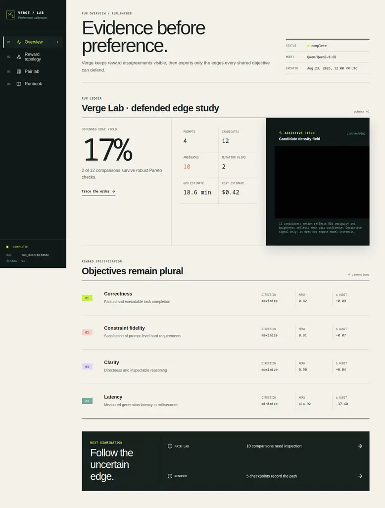

# Verge Lab

**Train on the edges your reward stack can defend.**



Verge Lab is a verifier-grounded preference-mining workbench for LLM post-training. It keeps prompt-level rubrics, executable constraints, judge confidence, and cost signals separate; builds a robust partial order over candidate responses; exports only defensible preference edges for DPO; and sends tradeoffs or low-confidence comparisons to a visible review queue.

The repository combines:

- a dependency-light Python analysis engine and CLI;
- a research-grade React interface for reward topology, pair evidence, and run lineage;
- open-source [ThreeUI](https://github.com/MengTo/threeui) instruments used as bounded visual context, with semantic controls and data views kept in accessible DOM/SVG;
- real Modal GPU entrypoints for candidate generation and LoRA DPO training.

## Why this project

Modern post-training increasingly mixes deterministic verification, prompt-specific rubrics, and model-based judgment. Collapsing those heterogeneous signals into one scalar can conceal reward conflicts and make weak evidence look certain. Verge uses a stricter rule:

1. Normalize every objective to a common “higher is better” direction.
2. Carry scorer confidence into conservative pair margins.
3. Add a preference edge only when the chosen response cannot regress on any shared objective and clears a strict margin on at least one.
4. Mark missing, low-confidence, or genuinely conflicting evidence as ambiguous.
5. Stress rewards with meaning-preserving mutations before exporting training pairs.

This is deliberately an offline evidence layer, not a claim that Pareto mining solves reward design. It makes the assumptions and exclusions inspectable before an optimizer amplifies them.

## Quick start

Requirements: Node.js 22+, npm 10+, and Python 3.11+ with [uv](https://docs.astral.sh/uv/). Modal GPU commands additionally require a configured Modal account.

```bash
npm install
uv sync --extra modal --dev
uv run verge demo --output artifacts/demo-run.json
npm run dev
```

Open the Vite URL. The included artifact is deterministic and drives four working views:

- **Overview** — run evidence, objective shifts, and checkpoint history;
- **Reward topology** — filterable candidate partial order with an equivalent data table;
- **Pair lab** — neutral A/B evidence for ambiguous comparisons, chosen/rejected evidence for defended edges, conservative margins, and mutation probes;
- **Runbook** — reproducible configuration, stages, and Modal handoff.

Production checks:

```bash
npm run check
uv run ruff check .
uv run pytest
```

## CLI

Generate the built-in reproducible study:

```bash
uv run verge demo --output artifacts/demo-run.json
```

Analyze candidate records using a JSON specification:

```bash
uv run verge analyze examples/candidates.json \
  --output artifacts/my-run.json
```

Export only defended edges in TRL-compatible preference format:

```bash
uv run verge export-dpo artifacts/my-run.json \
  --output artifacts/my-run.dpo.jsonl
```

The core package performs no model inference and executes no generated code. Verifiers are explicit primitives. GPU/model dependencies stay outside the local analysis path.

`analyze` treats supplied candidate scores and evidence as trusted measurements; it does not authenticate an external judge. Pair verdicts are always recomputed from those scores, and `export-dpo` rejects an artifact whose stored pair evidence differs from deterministic recomputation. Keep untrusted judge output outside the training path until its provenance and calibration have been established.

## Evidence rule

For objective \(j\), candidate \(a\), score \(s_{a,j}\), confidence \(c_{a,j}\), direction \(d_j \in \{-1,1\}\), and uncertainty scale \(\sigma\), Verge computes the conservative pair margin:

\[
m_j(a,b)=d_j(s_{a,j}-s_{b,j})
-\sigma\left[(1-c_{a,j})+(1-c_{b,j})\right]
\]

The default \(\sigma=0.05\) is a declared evidence penalty in each objective's native score units, not a statistical confidence interval. An edge \(a \succ b\) is defended only when:

\[
\forall j:\ m_j(a,b) \ge 0
\quad\text{and}\quad
\exists j:\ m_j(a,b) > \epsilon
\]

Scores below the configured confidence threshold are never compared. The artifact stores raw values, confidence, evidence text, conservative margins, and the reason for every defended or ambiguous verdict. The policy is intentionally conservative: fewer clean pairs beat a large silently noisy dataset.

## Artifact contract

`schemaVersion: 1` artifacts contain:

- immutable run/model metadata and derived summary counts;
- prompt-level rubrics and hard constraints;
- candidates with token/latency metadata, objective evidence, and stable projection coordinates;
- defended and ambiguous pair comparisons;
- mutation-audit results and score flips;
- checkpoint metrics and GPU-time estimates.

Stable content hashes and deterministic sorting make artifacts diffable and suitable for experiment lineage. The web app statically imports the same JSON generated by the Python CLI.

## Modal GPU workflow

Modal authentication is local to your machine; no credentials belong in this repository.

Cheap public-model smoke generation:

```bash
uv run modal run modal_app.py --smoke
```

Train a LoRA adapter from exported defended pairs:

```bash
uv run modal run modal_app.py \
  --train \
  --pairs-jsonl artifacts/my-run.dpo.jsonl \
  --adapter-name my-first-adapter \
  --adapter-version v1
```

The default is `Qwen/Qwen3-0.6B` on an L4, pinned to a reviewed Hugging Face commit and safetensors; other model IDs are rejected until explicitly reviewed and added. Hugging Face weights and adapters use separate persistent Modal Volumes. Remote functions return JSON-serializable manifests; failures propagate instead of falling back to fake local output. `artifacts/modal-smoke.json` and `artifacts/modal-training.json` record verified GPU runs; the trained adapter is persisted at the manifest's `modal-volume://` URI. Review `modal_app.py` before increasing model size, sequence length, sample count, or epochs.

## Research basis

- [DeepSeek-R1](https://arxiv.org/abs/2501.12948) — on-policy RL and distilled reasoning.
- [DAPO](https://arxiv.org/abs/2503.14476) and [Dr. GRPO](https://arxiv.org/abs/2503.20783) — concrete GRPO stability and objective corrections.
- [Spurious Rewards](https://arxiv.org/abs/2506.10947) — benchmark gains can emerge from prior amplification even under wrong rewards.
- [Rubrics as Rewards](https://arxiv.org/abs/2507.17746) — structured reward signals beyond binary-verifiable tasks.
- [MO-GRPO](https://arxiv.org/abs/2509.22047) — multi-objective imbalance and reward hacking in group-relative optimization.
- [Prompt-Level Reward Specifications](https://arxiv.org/abs/2605.29275) — reusable prompt-specific rubrics and executable constraints separated from scoring.
- [Reliability without Validity](https://arxiv.org/abs/2606.19544) — judge agreement and repeatability do not establish validity.

Verge’s robust partial-order rule is an engineering design motivated by these findings, not a reproduction or claimed result of any cited paper.

## Known limits

- Confidence is only as calibrated as its scorer. Conservative margins expose that assumption; they do not repair it.
- Pareto rules can discard useful tradeoff pairs and bias training data toward easy dominance.
- Meaning-preserving mutation templates are domain-specific and must be checked against source outputs.
- The included artifact is a deterministic demonstration, not a benchmark result.
- ThreeUI’s sandboxed visual components do not accept candidate graphs. Verge labels them as ambient instruments and uses real SVG/DOM for semantic topology.
- The selected ThreeUI 0.3.0 instruments execute third-party runtime assets inside opaque-origin `allow-scripts` iframes. No artifact data enters those frames and the page sends no referrer, but deployments with strict privacy or supply-chain requirements should replace them with vetted self-hosted assets.
- A successful training run still needs held-out exact evaluation, fixed-token baselines, random/format reward controls, and preferably a second model family.

## License

MIT. ThreeUI Community is separately distributed under the MIT license; bundled fonts and third-party assets retain their upstream licenses.
