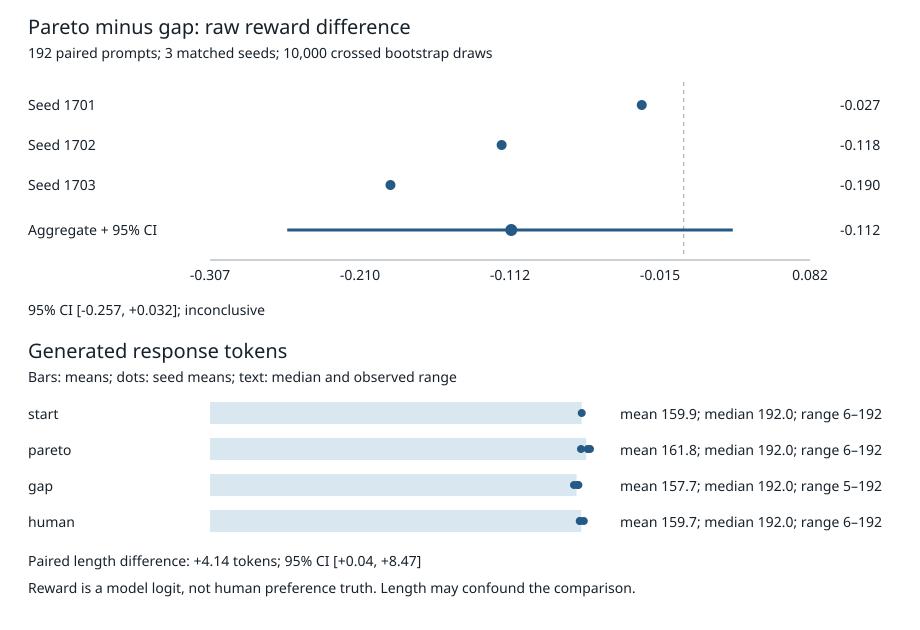

# Verge Lab

**DPO result: I found no clear Pareto advantage.** I trained **nine Qwen2.5-1.5B-Instruct adapters**, using **1,024 pairs per selector and three matched seeds**, then evaluated on **192 held-out HelpSteer2 prompts**. Pareto minus score-gap reward was **−0.112 logits**, with a crossed prompt/seed **95% interval of [−0.257, +0.032]**. The simpler gap selector had the higher point estimate, but my precommitted decision is **inconclusive**, not superiority or equivalence.



[Raw scores and generations](results/day-dpo/) · [Analysis](tools/analyze_day_dpo.py) · [Plan](docs/DPO_PLAN.md) · [Illustrative browser demo](https://mottopanikeiku.github.io/verge-lab/)

## What I built

Verge Lab mines preference pairs from multi-aspect scores and abstains when the aspects trade off. Its [Pareto rule](verge_lab/pareto.py) requires that no quality aspect worsens and at least one improves; the [DPO exporter](verge_lab/export.py) recomputes decisions before exporting.

For this experiment I maximize **correctness and coherence**. Overall **helpfulness** is held out to supply the baseline; complexity and verbosity describe style, not universal quality. These are nominal human scores with assumed complete confidence, not calibrated uncertainty estimates.

I compare three fixed training sets: a hash-ordered sample of defended Pareto pairs, the largest absolute helpfulness gaps, and a hash-ordered **human-preference reference**. All use the same eligible pool, equal size and unchanged training settings. They select different pairs, so this tests the complete selectors rather than isolating label direction. Pareto and gap share 330 pairs; Pareto and human share 958.

## Trained-model results

| Condition | Mean reward | Wins vs start | Mean response tokens |
| --- | ---: | ---: | ---: |
| Untrained start | 0.550 | — | 159.9 |
| Pareto | 0.620 | 49.83% | 161.8 |
| Helpfulness gap | 0.731 | 54.86% | 157.7 |
| Human reference | 0.651 | 50.00% | 159.7 |

Each trained row covers **576 comparisons**: three seeds × 192 prompts, against one common starting-model response per prompt. Ties remain in the win-rate denominator. Pareto-minus-gap seed means are **−0.027, −0.118 and −0.190**. I resample both prompt IDs and matched seed IDs in **10,000 crossed paired bootstrap draws**, not 576 independent observations. [Exact counts, lengths, correlations and intervals](results/day-dpo/summary.json).

All nine runs completed **64 optimizer steps and one epoch**, with finite losses and nonzero recorded adapter changes. I use identical TRL DPO settings: learning rate 0.00005, beta 0.1, LoRA rank 16, effective batch 16, and the starting checkpoint with its adapter disabled as the reference. [Cloud implementation and reproduction](docs/WORKFLOWS.md#equal-size-dpo-training-experiment).

## What the result does—and does not—say

My scorer is the pinned [OpenAssistant DeBERTa reward model](https://huggingface.co/OpenAssistant/reward-model-deberta-v3-large-v2/blob/c355404efa9ad2ad069f3a197cae0523c14244fc/README.md). Its declared WebGPT, summarization, synthetic-instruction and Anthropic-HH training sources predate HelpSteer2. Direct HelpSteer2 training overlap is excluded by those sources and chronology; older-source prompt overlap, shared pretraining and unknown Qwen instruction data are not ruled out. It is an older **reward proxy, not a human judge**.

- All 192 evaluation prompt hashes are absent from **every** HelpSteer2 training prompt, not just my selected pairs. Validation responses and labels never choose the training sets or settings.
- Three seeds and 1,024 pairs limit generalization. This is not a broad alignment-quality claim.
- Training truncation can remove prompt context; generation uses at most 192 new tokens. **Every condition's median is 192**, so longer-answer behavior is not evaluated. Length includes EOS when present.
- The scorer truncates **117/1,920 inputs** to 512 tokens. Pareto answers are about **4.14 tokens longer** than gap answers; I report length descriptively, without a post-hoc adjustment.

I committed the original [plan and exact datasets](https://github.com/mottopanikeiku/verge-lab/commit/12c887e) before training. The unscored pilot exceeded my original compute ceiling; I explicitly amended that ceiling before the complete experiment. Transport losses raised the allocation from $4.50 to $5.55 without changing the experiment. My all-attempt L4/CPU cost estimate is approximately **$4.70**, a conservative wrapper estimate—not an invoice.

## Earlier evidence and reproduction

My earlier human-label comparison also found no clear advantage: at matched yield, Pareto agreed with **281/286 (98.25%)** strict validation preferences versus gap's **277/282 (98.23%)**. [Full denominators and sensitivities](results/human-preferences/summary.json). I retain fixed-sample [full-text disagreement reviews](results/disagreement-review/review.txt), explicitly AI-assisted rather than independent human verification. The browser uses authored illustrative examples, not measured training curves.

Recompute the recorded model result offline, without models, GPU or paid APIs:

```bash
uv sync --locked --dev
uv run python tools/analyze_day_dpo.py
```

[HelpSteer2](https://arxiv.org/abs/2406.08673) and [HelpSteer2-Preference](https://arxiv.org/abs/2410.01257), by NVIDIA, Scale AI and Zhilin Wang et al., are CC-BY-4.0. Qwen2.5 is Apache-2.0; the scorer and project code are MIT. [DPO](https://arxiv.org/abs/2305.18290) supplies the training objective.

Written with AI coding assistance.
