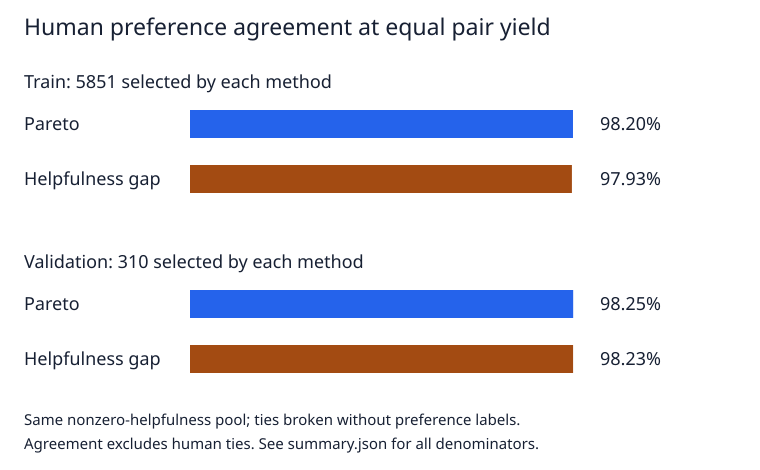

# Verge Lab

Verge Lab chooses preference pairs from multi-aspect response scores and abstains when the aspects trade off.

**Human-ratings result:** I found no clear validation advantage over a simple overall-score-gap selector. On HelpSteer2, both methods selected **310 pairs** at matched yield: Pareto agreed with **281/286 (98.25%)** strict human preferences, versus **277/282 (98.23%)** for the helpfulness-gap baseline. Both contradicted **5 human preferences**; the remaining selected pairs had human ties. [Results and denominators](results/human-preferences/summary.json).

[Live demo](https://mottopanikeiku.github.io/verge-lab/) · [Core rule](verge_lab/pareto.py) · [Human comparison](tools/compare_human_preferences.py)



## What I tested

**Question:** Does refusing aspect tradeoffs select better human preference labels than simply choosing pairs with a large overall-score gap?

I joined the pinned HelpSteer2 human ratings to its separately collected pairwise preferences by exact prompt and response hashes: **8,677 train and 448 validation pairs**, with no unmatched preference pairs. [Source, license and join metadata](results/human-preferences/source-metadata.json).

The primary rule maximizes **correctness and coherence**. I hold out overall **helpfulness**, which supplies the baseline; complexity and verbosity describe style rather than universal quality. Ratings are divided by their scale maximum, confidence is assumed complete, and the uncertainty penalty is zero. These are nominal score comparisons, not calibrated reliability estimates.

The existing [Pareto implementation](verge_lab/pareto.py) keeps a winner only when no aspect score worsens and at least one improves beyond the threshold. The [comparison script](tools/compare_human_preferences.py) uses that implementation, selects the baseline by absolute helpfulness gap, and evaluates both against the sign of the separate human preference—not an aspect average. The [exporter](verge_lab/export.py) recomputes decisions before writing DPO pairs.

## Matched-yield comparison

All numbers below come from [summary.json](results/human-preferences/summary.json); [pairs.csv](results/human-preferences/pairs.csv) identifies every decision.

| Split / selector | Selected | Human agree | Contradict | Human tie | Strict agreement |
| --- | ---: | ---: | ---: | ---: | ---: |
| Train / Pareto | 5,851 | 5,244 | 96 | 511 | 98.20% |
| Train / helpfulness gap | 5,851 | 5,196 | 110 | 545 | 97.93% |
| Validation / Pareto | 310 | 281 | 5 | 24 | 98.25% |
| Validation / helpfulness gap | 310 | 277 | 5 | 28 | 98.23% |

Matching the unrestricted Pareto yield is impossible without inventing directions for helpfulness ties: it defends **338 validation pairs**, but only **333** have a nonzero helpfulness gap. I therefore exclude helpfulness ties from **both** selectors for the table. Among all defended validation pairs, humans contradict **8/300 strictly ranked pairs (2.67%)**, or **8/338 selected pairs (2.37%)**, with **38 human ties**.

Equal gaps are broken without looking at preference labels. Across the recorded tie-breaking seeds, validation baseline agreement ranges from **98.21% to 98.95%**. The tiny headline difference does not establish superiority. The summary also reports three-quality-aspect and naive five-aspect sensitivities, tie counts, abstention reasons and Wilson intervals. [Method details](docs/WORKFLOWS.md#human-ratings-and-preferences).

## Why disagreements matter

The earlier [UltraFeedback result](results/public-preferences/summary.json) defended **820/1,200** pairs and opposed the separate GPT-4 overall ranking in **132/706 (18.7%)** strictly ranked cases. These are not human error labels.

I reviewed a fixed random sample of **12** such disagreements against full upstream responses and rationales. Categories included factual failures, coverage versus concision, confidence cues, premise handling, boilerplate and rationale/text mismatches. I favored the overall direction in **6**, Pareto in **3**, and remained uncertain in **3**. This is an explicitly **AI-assisted qualitative review**, not independent human verification. [Full texts, selection and per-case notes](results/disagreement-review/review.txt).

I also reviewed **12 of 151 human contradictions**: **8** favored the human direction, **2** Pareto, **2** were uncertain. Categories included prompt constraints versus fluency, grounding, scope and audience alignment. [Full-text human review](results/disagreement-review/human-review.txt); the same AI-assisted limitations apply.

## Reproduce

Python and uv on a CPU; no models, GPU, paid APIs or inference. The recorded human analysis costs **$0** ([summary](results/human-preferences/summary.json)).

```bash
uv sync --locked --dev
nice -n 19 uv run python tools/compare_human_preferences.py
nice -n 19 uv run pytest
```

The analysis uses committed compact scores offline. Add `--fetch --cache .cache/helpsteer2` to rebuild from pinned upstream files. [UI, export and checks](docs/WORKFLOWS.md).

## Limits and attribution

- The validation sample is small, and human ratings are rounded, filtered annotations—not objective truth.
- Equal yield does not imply identical pairs or identical numbers of strict human labels. Human ties are never counted as agreement.
- Separate preference collection does not guarantee independent annotators; no downstream training benefit is measured.
- The browser uses authored **illustrative examples**, not these benchmark rows or measured training curves.

[HelpSteer2](https://arxiv.org/abs/2406.08673) and [HelpSteer2-Preference](https://arxiv.org/abs/2410.01257), by NVIDIA, Scale AI and Zhilin Wang et al., are CC-BY-4.0. HelpSteer3 has preferences and free-text feedback but no suitable matched numeric aspect ratings; I do not invent them. [UltraFeedback](https://arxiv.org/abs/2310.01377) supplies GPT-4 ratings on [TruthfulQA](https://arxiv.org/abs/2109.07958); its MIT card does not remove upstream content terms. [DPO](https://arxiv.org/abs/2305.18290) motivates the export format. Project code is MIT.

Written with AI coding assistance.
